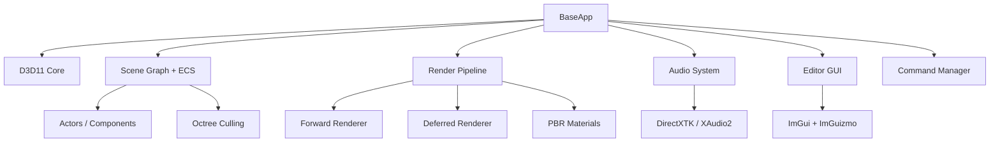
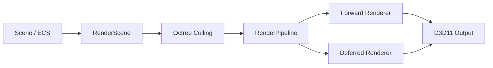
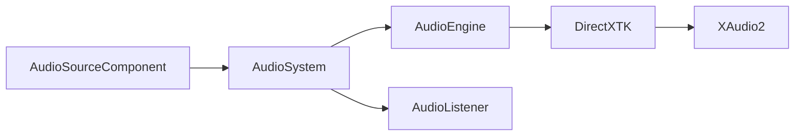

# WildvineEngine

> **Custom 3D graphics engine and editor built in C++ / Direct3D 11.**

WildvineEngine is a university graphics-engine project that evolved from a basic Direct3D 11 bring-up into a small editor-oriented 3D engine. The current `main` branch contains the complete development line, including ECS, scene management, forward/deferred rendering, PBR materials, model import, particles, spatial audio, serialization, culling, Play Mode and an ImGui/ImGuizmo editor.

**Current state:** `main` contains the merged `audio-play-save` development line. The repository history preserves the evolution of the engine.

---

## 🇲🇽 Español

### ¿Qué es?

WildvineEngine es un motor gráfico 3D desarrollado en **C++ y Direct3D 11**, acompañado de un editor para construir y probar escenas. El proyecto pasó de una base de inicialización de D3D11 a una arquitectura con sistemas de renderizado, ECS, escena, assets, partículas, audio 3D y herramientas de edición.

### Sistemas principales

| Sistema | Descripción |
|---|---|
| **D3D11 Core** | Device, context, swap chain, buffers, views, shaders y viewport. |
| **ECS** | Entities, Actors y componentes para representar objetos y comportamiento. |
| **Scene Graph** | Jerarquía de escena, transformaciones y organización de actores. |
| **Forward / Deferred Rendering** | Dos rutas de renderizado dentro del pipeline. |
| **PBR** | Materiales y flujo de renderizado basado en physically based rendering. |
| **Model Loading** | Soporte para OBJ, FBX y glTF/GLB. |
| **Octree Culling** | Culling espacial basado en frustum para reducir trabajo de renderizado. |
| **Particles** | Emisión CPU de partículas con formas y presets. |
| **3D Audio** | Audio espacial con DirectXTK, listener, fuentes y atenuación. |
| **Play Mode** | Cambio entre edición y ejecución con control de estado de escena. |
| **Serialization** | Guardado/carga binaria versionada de escenas y prefabs. |
| **Editor** | ImGui + ImGuizmo, docking, inspector, viewport y herramientas de edición. |
| **Undo / Redo** | Command pattern para acciones editables. |
| **Engine Utilities** | Matemáticas y contenedores propios bajo el namespace `EU`. |

### Arquitectura

### Pipeline de renderizado

### Audio 3D

### Documentación

- [Architecture](docs/architecture.md)
- [Rendering](docs/rendering.md)
- [Audio](docs/audio.md)
- [Scene & ECS](docs/scene-system.md)
- [Particles](docs/particles.md)
- [Serialization](docs/serialization.md)
- [Editor & Tools](docs/editor.md)
- [Doxygen documentation](WildvineEngine/docs/doxygen/README.md)

### Tecnologías

- C++
- Direct3D 11
- HLSL
- DirectXTK
- ImGui
- ImGuizmo
- FBX SDK
- cgltf
- Visual Studio / MSBuild

### Estado y alcance

Este repositorio documenta un proyecto de aprendizaje que fue creciendo hacia una arquitectura de engine/editor. Algunas áreas siguen siendo deliberadamente simples frente a un motor comercial: por ejemplo, el audio no incluye mixers/busses avanzados, streaming largo, occlusion o reverb zones, y el engine todavía concentra bastante coordinación en `BaseApp`.

> **Build note:** la documentación describe el estado del código y la integración observada en el repositorio. El build actual no se declara verificado automáticamente por CI.

---

## 🇺🇸 English

### What is it?

WildvineEngine is a **C++ / Direct3D 11 3D graphics engine and editor**. It started as a graphics-programming coursework codebase and evolved into a small editor-oriented engine with rendering, ECS, scene management, asset import, particles, spatial audio and tooling.

### Core systems

- Direct3D 11 rendering core
- Entity Component System
- Scene Graph and hierarchy
- Forward and Deferred rendering
- PBR materials
- OBJ / FBX / glTF / GLB asset loading
- Octree frustum culling
- CPU particle system with presets
- 3D spatial audio through DirectXTK
- Play Mode
- Versioned binary scene/prefab serialization
- ImGui + ImGuizmo editor tooling
- Undo / Redo command system
- Custom math and container utilities

### Architecture

The engine is coordinated by `BaseApp`, which owns and dispatches the major runtime/editor systems. Scene data flows through the Scene Graph/ECS into the rendering pipeline, while audio sources are registered with the audio subsystem. The editor exposes scene, rendering, audio and particle controls through ImGui.

### Documentation

See the [`docs/`](docs/) directory for focused system documentation and diagrams. The repository also contains a Doxygen setup under `WildvineEngine/docs/doxygen/`.

### Technical highlights

The most portfolio-relevant areas are the **Forward/Deferred renderer and PBR pipeline**, **octree culling**, **versioned binary serialization**, **editor tooling**, and the **DirectXTK-based 3D audio integration**. These systems demonstrate graphics programming, engine architecture, C++ systems design and tooling rather than only gameplay scripting.

### Limitations

WildvineEngine is an educational/personal engine rather than a production-ready commercial engine. Some subsystems intentionally favor clarity and experimentation over abstraction depth or production-scale optimization.

---

## Project history

The repository preserves the development history that led from a minimal D3D11 foundation to the current engine. The `audio-play-save` line was merged into `main`, so `main` is now the reference branch for the complete documented state.

## License / third-party code

Check the repository and third-party directories for the applicable licenses. WildvineEngine includes external dependencies and should not be interpreted as relicensing those dependencies under a project-level license.
