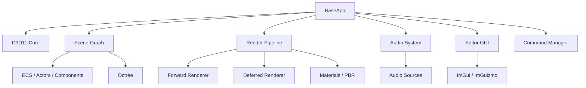
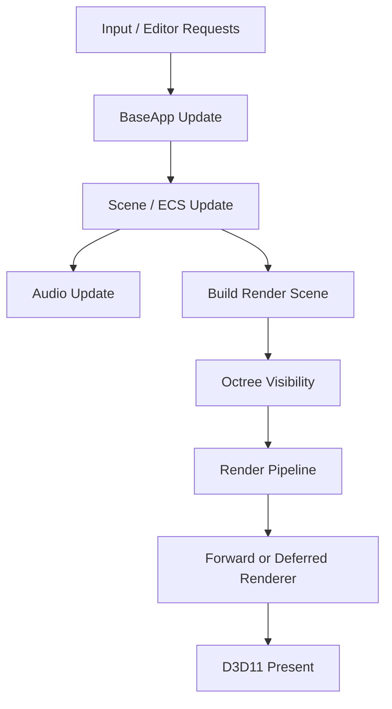

# WildvineEngine Architecture

## Overview

WildvineEngine is organized around `BaseApp`, which coordinates the editor/runtime loop and owns the major engine systems. The architecture combines a Scene Graph/ECS model with a rendering pipeline and editor tooling.

## Main responsibilities

### `BaseApp`

Acts as the application-level coordinator. It drives initialization, update, rendering, editor requests, Play Mode transitions and scene persistence.

### Scene Graph + ECS

Actors/entities are represented through components such as transforms, mesh renderers, lights, audio sources, particles and runtime behavior. The Scene Graph provides hierarchy and parent/child relationships.

### Rendering

`RenderScene` gathers renderable scene information. The render pipeline can route the scene through Forward or Deferred rendering. The Octree provides spatial visibility queries before rendering.

### Audio

`AudioSystem` consumes `AudioSourceComponent` state and connects the engine's audio sources/listener to DirectXTK.

### Editor

ImGui and ImGuizmo provide docking, inspector-style controls, viewport tools and gizmos. Editor actions are coordinated with the command system where undo/redo is supported.

## Frame-level flow

## Design notes

The project favors a practical educational architecture. `BaseApp` is intentionally central rather than being split into a large dependency-injection framework. Engine utilities provide custom math/container types under the `EU` namespace.

## Related systems

- [Rendering](rendering.md)
- [Audio](audio.md)
- [Scene & ECS](scene-system.md)
- [Particles](particles.md)
- [Serialization](serialization.md)
- [Editor](editor.md)
