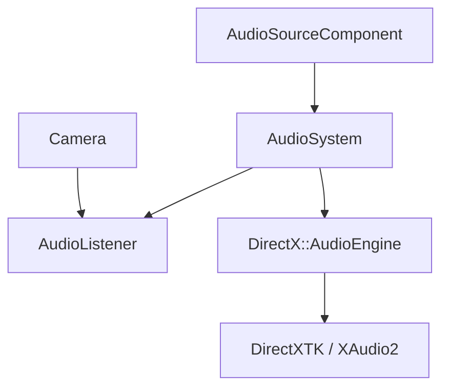

# Audio System

WildvineEngine integrates a 3D audio subsystem using DirectXTK. Audio configuration is represented by an ECS component while runtime ownership remains in `AudioSystem`.

## AudioSourceComponent

`AudioSourceComponent` stores source configuration and deferred playback requests, including:

- audio path
- volume
- pitch
- loop
- auto activation
- mute state
- spatial audio toggle
- minimum and maximum attenuation distance

The component does not own DirectXTK audio objects. This keeps the ECS-facing data separate from the backend implementation.

## AudioSystem

`AudioSystem` owns the runtime audio engine through an internal state object. During the frame update it:

1. Updates the DirectXTK audio engine.
2. Positions the listener from the active camera.
3. Loads or refreshes registered sound effects when their source path changes.
4. Calculates source attenuation.
5. Applies 3D positioning to spatial sources.
6. Processes deferred play/stop requests.

The system also exposes master-volume control, pause/resume, stop-all and readiness/state queries.

## Play Mode

Entering Play Mode activates sources marked for automatic activation. Leaving Play Mode stops runtime sources and performs a global stop-all operation.

## Import and runtime format

Runtime playback uses PCM WAV through DirectXTK's `SoundEffect` path. The editor can convert Media Foundation-supported source files into WAV assets during import, allowing formats such as MP3/FLAC to enter the project's asset workflow while keeping runtime playback on the supported WAV path.

## Spatial audio

For spatial sources, the system uses the camera as the listener and applies source positioning plus attenuation between configurable minimum and maximum distances. The engine uses a Z-up coordinate convention, so coordinate conversion at the audio boundary is important when mapping to the underlying audio API's coordinate expectations.

## Scene persistence

Audio source configuration is serialized with the scene's versioned binary format. This includes source path, playback properties, spatial settings and attenuation distances.

## Editor integration

The ImGui editor exposes:

- master volume
- pause/resume controls
- source path selection
- volume and pitch
- loop/auto-activate/mute controls
- spatial audio toggle
- attenuation range editing
- play/stop controls

The spatial range gizmo is especially useful as a portfolio visual because it demonstrates the connection between editor tooling and runtime audio behavior.

## Current limitations

The current implementation is intentionally focused rather than a complete production audio engine. It does not provide advanced mixer buses, long-form streaming, occlusion or reverb-zone systems. Attenuation is also handled with a simple distance-based model in the engine layer.

## Portfolio value

The audio subsystem demonstrates more than simply playing a sound: it connects ECS data, editor authoring, runtime lifecycle, 3D listener/source positioning, asset conversion and scene serialization into one engine feature.