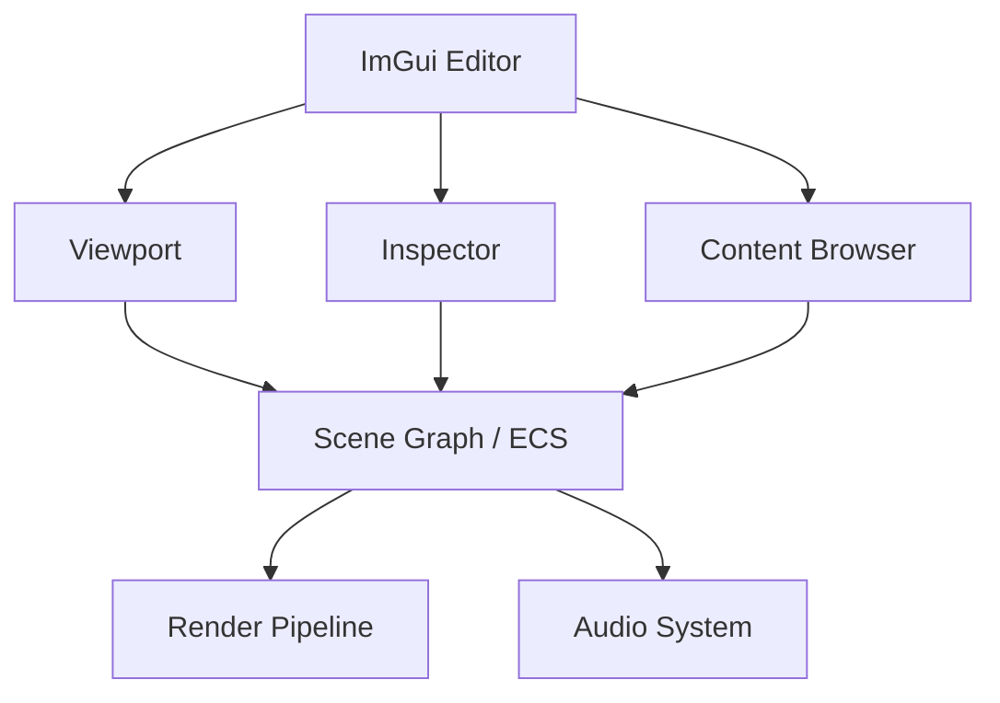

# Editor and Tooling

WildvineEngine is not only a runtime renderer. The project contains an ImGui/ImGuizmo-based editor used to inspect and author engine data.

## Main tooling

- ImGui docking interface.
- ImGuizmo transform manipulation.
- Scene/actor inspection.
- Content Browser workflows.
- Audio source authoring and playback controls.
- Particle emitter configuration.
- Play Mode controls.
- Undo/Redo through a Command pattern.

## Command system

`CommandManager` and `ICommand` implement an Undo/Redo workflow. The command history is bounded and a new command clears the redo stack, matching the conventional editor behavior users expect.

## Play Mode

The editor can switch from editing to runtime execution. This creates a useful separation for portfolio demonstrations: the same scene can be authored in the editor and then executed through the engine's runtime path.

## Portfolio presentation

The editor is one of the strongest visual aspects of WildvineEngine. Recommended screenshots/GIFs:

1. Full editor viewport with hierarchy and inspector.
2. PBR scene with imported assets.
3. Audio inspector with spatial attenuation gizmo.
4. Particle presets running in the viewport.
5. Play Mode transition.
6. Octree/culling statistics.

These visuals should accompany the technical README rather than replacing the technical explanation.