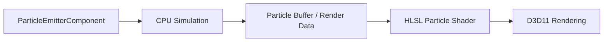

# Particle System

WildvineEngine includes a CPU-simulated particle emitter integrated as an ECS component.

## Features

The emitter supports:

- Point, Box, Sphere and Cone emission shapes.
- Continuous and Burst emission modes.
- Additive and Alpha blending.
- Fire, Smoke, Sparks and Rain presets.
- Configurable particle capacity, with the current implementation capped at 1024 particles.

## Editor workflow

Particle settings are part of the scene/editor workflow, allowing emitters to be authored as components and saved with the scene.

## Why it matters

The particle system demonstrates the complete path from ECS configuration to simulation and GPU rendering. For portfolio material, presets such as fire, smoke and sparks are more visually useful than a code-only screenshot.