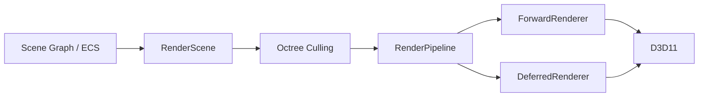
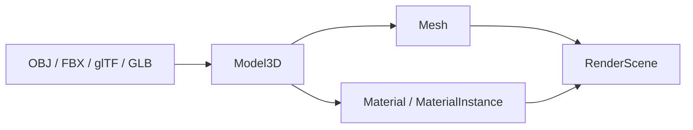

# Rendering

## Overview

WildvineEngine uses a modular rendering layer on top of Direct3D 11. Scene data is collected into `RenderScene` and passed to a `RenderPipeline`, which can dispatch either a forward or deferred renderer.

## Rendering components

- **RenderPipeline** coordinates the rendering path.
- **ForwardRenderer** performs direct lighting/rendering in a forward pass.
- **DeferredRenderer** separates scene information into intermediate buffers before lighting.
- **RenderScene** provides the renderable scene representation.
- **Mesh / Material / MaterialInstance** represent geometry and surface data.
- **PBR support** provides a physically based material workflow.
- **Octree** performs spatial organization and frustum visibility tests before rendering.

## Asset flow

The engine supports model import through OBJ, FBX and glTF/GLB paths. Imported data is converted into engine-side mesh/material representations before entering the rendering scene.

## Forward vs Deferred

### Forward

The forward path is useful when the renderer can evaluate lighting while drawing the geometry. It keeps the pipeline comparatively direct and is suitable for scenes where the number of relevant lights is manageable.

### Deferred

The deferred path stores scene attributes in intermediate render targets and evaluates lighting from that data. It is useful when many lights affect the scene and is a significant part of the project's graphics-programming scope.

## Culling

`SceneGraph/Octree` provides spatial partitioning and frustum tests. The current implementation rebuilds/querys the octree from renderable scene objects and reports culling statistics. This is an engine-level optimization rather than a gameplay feature.

## Shaders

HLSL shaders are part of the rendering pipeline. D3D11 resources such as buffers, shader programs, views and input layouts form the lower-level graphics API layer used by the higher-level renderers.

## Portfolio highlights

For a portfolio presentation, the strongest rendering demonstrations are:

1. PBR material rendering.
2. Forward/deferred renderer selection.
3. Octree culling and visible-object statistics.
4. glTF/FBX/OBJ asset import.
5. Editor viewport and gizmos.

## Known scope

WildvineEngine is an educational/personal engine, not a commercial renderer. The architecture is intentionally practical and experimental, and some coordination remains centralized in `BaseApp`.