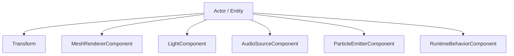
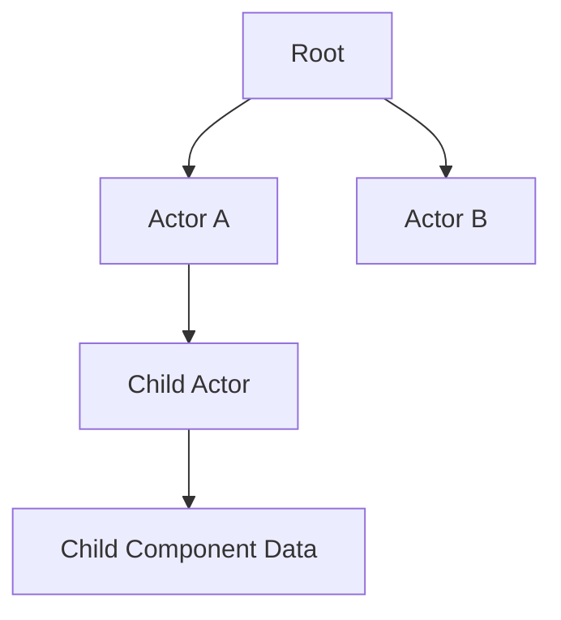

# Scene System

WildvineEngine combines an Entity Component System (ECS) with a Scene Graph to represent and organize runtime/editor objects.

## ECS

Actors/entities are composed from focused components such as transforms, mesh renderers, lights, audio sources, particles and runtime behavior.

This approach keeps feature data separated from the object identity and allows the editor/runtime to operate on the same scene representation.

## Scene Graph

The Scene Graph provides hierarchical relationships between actors. Hierarchy and transform data can therefore be represented as a tree while ECS components hold the behavior/data associated with each object.

## Octree

The scene also contains an octree used for spatial partitioning and frustum culling. Renderable objects can be organized spatially so visibility queries do not need to process every object equally.

## Scene lifecycle

`BaseApp` coordinates scene updates, rendering, editor requests and persistence. The same scene can be edited through the GUI and entered into Play Mode.

## Play Mode

The editor can capture the relevant scene state, enter runtime behavior, and restore the editing state when Play Mode ends. Runtime behavior is represented separately from editor-only manipulation.

## Portfolio value

The combination of ECS + Scene Graph + spatial culling is one of the most useful parts of WildvineEngine to explain in a portfolio because it shows engine architecture rather than only API usage.