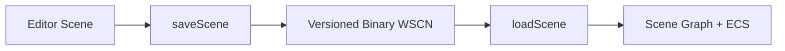

# Scene and Prefab Serialization

WildvineEngine uses a versioned binary format for scene persistence and a separate binary representation for prefabs.

## Why version the format?

Engine data changes as new components and systems are introduced. A version field allows loading code to distinguish older scene layouts from newer ones instead of assuming every file has the latest structure.

## Versioning

The implementation uses the `WSCN` scene magic and a version number. Audio persistence was introduced through a later format version, followed by another version for particle persistence. Loading uses version gates so older scene data can remain distinguishable from newer layouts.

Prefabs use the `WVPF` binary magic.

## Stored engine state

Depending on the format version, serialized scene state includes engine-side object/component information such as transforms, render data, audio configuration and particle configuration.

## Portfolio value

This system is worth documenting because it demonstrates an engine concern that is often absent from small graphics projects: persistent data must evolve alongside the codebase. Versioned serialization is therefore part of the engine architecture, not merely file I/O.